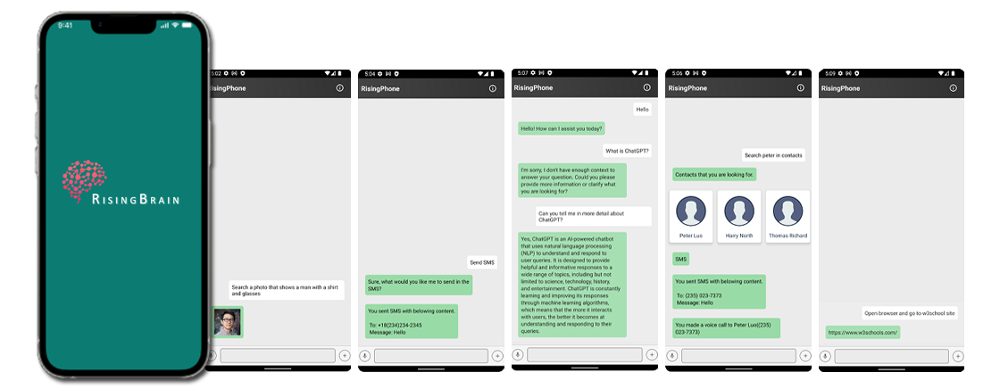

# RisingAndroid

All complex software including operating systems will need to be rewritten from the ground up to take advantage of machine learning. In our OS, a AI will manage all apps via plugins, which can be prompted by the user. Our plugins can run as an openai plugin, or in our backend.

### RisingPhone

  

- 📱 Support for mobile devices to manage all apps via plugin as its launcher.
- 🔗 Multiple API support (Web API for Free and Plus users, GPT-3.5, GPT-4, etc.).
- 🔍 Integration to all mainstream search engines, and custom queries to support additional sites.

### Features

| Title  | Description  |
| ------------ | ------------ |
| General Chat | Users can chat with AI plugins. |
| Open Browser Automatically |  If a user is going to open browser, the app opens browser and search what a user wants automatically |
| Image Search System  | A user can search image on Android local storage |
| Send SMS | If a user says that send SMS, mobile open SMS editor and a user can send SMS using the editor. |

[[Rising Brain](https://github.com/ttt246/RisingBrain)]
### Run locally
- Copy google-services.json into app folder of project

### CI/CD
- set google-services.json to github secrets

### Test
- Unit Test
- Instrumented Test

### Contributing

Please refer to each project's style and contribution guidelines for submitting patches and additions. In general, we follow the "fork-and-pull" Git workflow.

 1. **Fork** the repo on GitHub
 2. **Clone** the project to your own machine
 3. **Commit** changes to your own branch
 4. **Push** your work back up to your fork
 5. Submit a **Pull request** so that we can review your changes

NOTE: Be sure to merge the latest from "upstream" before making a pull request!