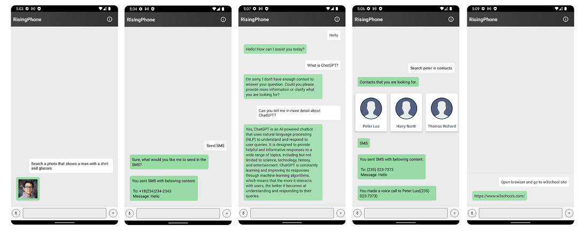

# 🌍 RisingBrain-Android:Your AI OS Companion 📱

Venture into the future of artificial intelligence with **RisingBrain Android**- an essential component of 🧠RisingBrain🧠 

We bring the revolutionary AI-powered OS right at your fingertips with our Android application.
This Android counterpart ensures you get all the smart features of RisingBrain OS on your smartphone. 

Let's dive into the specifics!😆

## Getting Started 🏁

  

    

This application has built with **MVVM architecture pattern**. (Using Android Architecture Components).

Repository Pattern, to abstract the source of data in the application.
Using of View Model, Live Data and data binding.

***The Application utilizes such popular libraries as: [Room](https://developer.android.com/training/data-storage/room), [OkHttp](https://github.com/square/okhttp), [Retrofit](https://github.com/square/retrofit), [Glide](https://github.com/bumptech/glide), etc.
Written in [Kotlin](https://kotlinlang.org/).***

## Features 💫

|             Title              |                                                  Description                                                   |                             ScreenShot                             |
|:------------------------------:|:--------------------------------------------------------------------------------------------------------------:|:------------------------------------------------------------------:|
| Around-the-Clock Conversations |                                        Enjoy casual chats with Rising AI, right from your Android device.                                         |    |
|        Quick Web Tours         |      Experience swift and accurate browsing based on your interests or queries.      |    |
|        Picture Perfect         |                                Hunt for images using visual cues or descriptions with our smart image search.                                |      |
|    Stay Connected, Swiftly     |         Find contacts and initiate calls or text messages without extra effort.         |    |
|      On-Time, Every Time       | Set timely reminders and never miss an important event with our alarm feature. |      |
|         Swift Emailing         |                Send emails instantly, without having to switch between apps.                 |        |
|    Configured Just for You     |                    Modify backend settings as preferred for an optimized user experience.                    |    |
|         Real-Time Data         |                                 Stay updated with real-time data reflecting in your responses.                                  |  |

## Compatibility 🤝
Our Android app is designed with a broad compatibility range, supporting various Android versions. Regardless of the device you own, RisingBrain Android ensures a seamless, advanced, and user-centric experience.

## Contributing 💪
We appreciate your interest in enhancing our work! Please respect the style and contribution guidelines of every project when submitting patches and additions. Our general Git workflow of choice is "fork-and-pull".

 1. **Fork** the repository on GitHub
 2. **Clone** your fork to your machine
 3. **Commit** the changes to your personal branch
 4. **Push** these updates back to your fork
 5. Don't forget to submit a **Pull Request** for us to study your contributions.

NOTE: Sync with "upstream" to have the latest updates before you make a pull request!