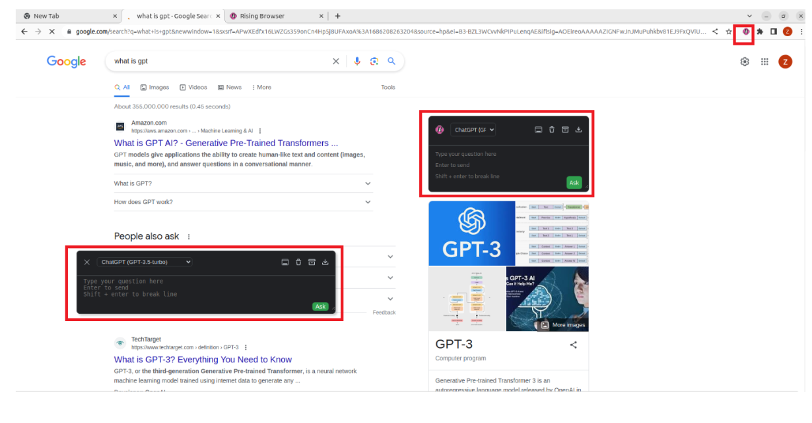

<p align="center">
    
</p>

<h1 align="center">Rising Browser(Extension)</h1>

<div align="center">


All complex software including operating systems will need to be rewritten from the ground up to take advantage of machine learning. It will manipulate the browser automatically. Our plugins can run as an openai plugin, or in our backend.
</div>

### Achievement
<p align='center'>
  
</p>

- 📱 Support for mobile devices to manage browser.
- 🌍 Support all web browsers to manipulate it automatically as its extension.
- 🔗 Multiple API support (Web API for Free and Plus users, GPT-3.5, GPT-4, etc.).
- 🔍 Integration to all mainstream search engines, and custom queries to support additional sites.

###  ✨ Features

- 🌈 Call up the chat dialog box on any page at any time. (<kbd>Ctrl</kbd>+<kbd>B</kbd>)
- 📱 Support for mobile devices.
- 📓 Summarize any page with right-click menu. (<kbd>Alt</kbd>+<kbd>B</kbd>)
- 📖 Independent conversation page. (<kbd>Ctrl</kbd>+<kbd>Shift</kbd>+<kbd>H</kbd>)
- 🔗 Multiple API support (Web API for Free and Plus users, GPT-3.5, GPT-4, New Bing, Self-Hosted, Azure, Poe etc.).
- 🔍 Integration to all mainstream search engines, and custom queries to support additional sites.
- 🧰 Selection tool and right-click menu to perform various tasks, such as translation, summarization, polishing,
  sentiment analysis, paragraph division, code explain and queries.
- 🗂️ Static cards support floating chat boxes for multi-branch conversations.
- 🖨️ Easily save your complete chat records or copy them partially.
- 🎨 Powerful rendering support, whether for code highlighting or complex mathematical formulas.
- 🌍 Language preference support.
- 📝 Custom API address support.
- ⚙️ All site adaptations and selection tools(bubble) can be freely switched on or off, disable modules you don't need.
- 💡 Selection tools and site adaptation are easy to develop and extend, see the [Development&Contributing][dev-url]
  section.
- 😉 Chat to improve the answer quality.

###  ✨ How to install

#####  install node_modules
  ``` bash
  npm install
  ```

##### build and install extention
  ```
  npm run dev --development
  ```

##### Enter this into your Chrome search bar:

    chrome://extensions/

##### In the top-right corner, turn on developer mode.

    This will then render two buttons in the top-left corner.
    Load the unpacked extension and the packed extension.
    Click on “Load unpacked extension,” and select your build folder.

### Contributing
Please refer to each project's style and contribution guidelines for submitting patches and additions. In general, we follow the "fork-and-pull" Git workflow.

1. **Fork** the repo on GitHub
2. **Clone** the project to your own machine
3. **Commit** changes to your own branch
4. **Push** your work back up to your fork
5. Submit a **Pull request** so that we can review your changes

NOTE: Be sure to merge the latest from "upstream" before making a pull request!