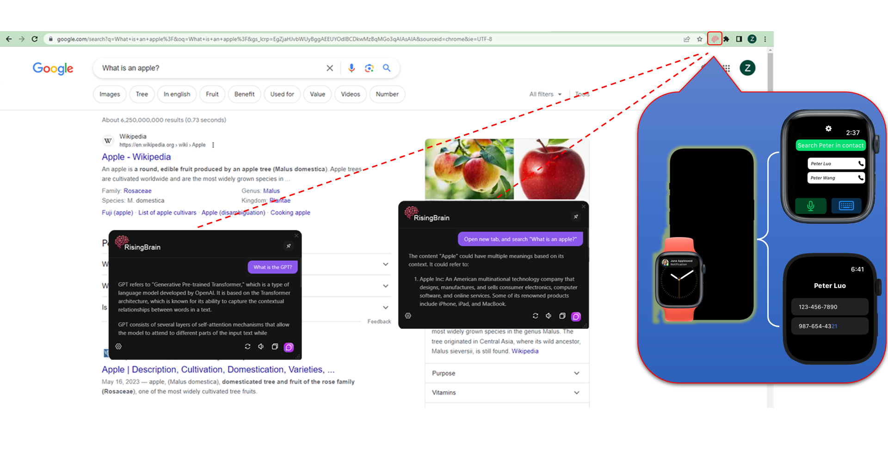

## 🧠 RisingBrain: Your Future-Forward AI-Powered OS 🚀

  
    
🧠 <b>RisingBrain</b>: Your Future-Forward AI-Powered OS 🚀

**Notice:** *This codebase is under active development and has been recently made public. Please expect frequent updates.*

Are you tired of your dull and monotonous operating system? Say hello to <b>RisingBrain</b>!

Our project is aimed at revolutionizing how complex software, including operating systems, leverage machine learning. Imagine an OS where an AI manages all apps via fun and interactive plugins, operating as OpenAI plugins or within our backend.

Sounds exciting?😂 Let's dive into it! 🏊‍♂️

## 1. Look What We've Achieved! 🏆

  
  
  

Key features of **RisingBrain** that will make you fall in love with your OS all over again:

- 📱 **Mobile-First Attitude**: 
    - **Say hello🙋‍♀️ to your intelligent OS** with a smart chat interface that can control all your phone apps via conversational prompts. Powered by state-of-the-art language models like <a href="https://openai.com/research/gpt-4">GPT-4</a>, <a href="https://autogpt.net/">AutoGPT</a>, <a href="https://huggingface.co/blog/falcon">Falcon</a>, <a href="https://huggingface.co/spaces/NeuralInternet/BabyAGI">BabyAGI</a>, <a href="https://en.wikipedia.org/wiki/BERT_(language_model)">BERT</a>, <a href="https://huggingface.co/docs/transformers/model_doc/t5">T5</a> and more, our chatbot is a league apart!
    - **Control is in your hands🖐**: Manage contacts, images, audio, videos, documents, and even your browsers like <em>Chrome</em>, <em>Firefox</em>, and <em>Safari</em> all from a single app.
    - **Real-time data at your fingertip👆**: Whether it's news, weather, financial status, or sending emails - we've got you covered.
    - **Confused with text images or need answers based on PDFs?** Our robust <a href="https://www.onlineocr.net/">OCR</a> functionality is at your service.
    - **Backend? Your choice**: You decide where to route the backend - set up and manage a range of cloud services like <a href="https://openai.com/">OpenAI</a> and <a href="https://firebase.google.com/">Firebase</a>.
    - Available on both **Android and iOS**, it's also geared to manage your calendar and alarms. Ultimate ease, don't you think😉?
- 🌍 **Universal Browser Extension**: 
    - Meet your new web companion, compatible with browsers like <em>Chrome</em>, <em>Safari</em>, <em>Firefox</em>, etc. Not just for general chat, it's adept at handling several browser functionalities based on your prompts.
    - Tasks?🤨 Consider them done: From sending emails, booking tables, scheduling appointments, to calendar management - it does it all!
- ⌚ **Apple to the Rescue**: 
    - Your favorite general chat is now on Apple Watch. Better yet, it enables you to control your Android app, including contacts and images.
    - Never be apart: Left your phone at home? No worries👌, control your Android phone right through the app on your Apple Watch – even find contacts!

<b><em>How to access us</em></b>:  <a href="https://github.com/ttt246/Brain/tree/main/Brain">Brain🧠</a> | <a href="https://github.com/ttt246/Brain/tree/main/Android">Android Application📱</a> | <a href="https://github.com/ttt246/Brain/tree/main/Extension">Browser Extension🔍</a> | <a href="https://github.com/ttt246/Brain/tree/main/WatchApp">Apple Watch⌚</a>

## 2. Functionalities You Need to Check Out 🚀

**RisingBrain** doesn't just look good, it's super smart too! Here's what it can do:

- 📱 **Android App**: 
    - **Cosy Convos**: Simplify life with general chats with our Rising AI.
    - **Swift Browsing**: Swiftly access any piece of information on the internet within seconds.
    - **Image Hunt**: Search for images effortlessly using visual references or descriptive prompts.
    - **Momentary Contact Search**: Get in touch with any contact quickly and efficiently.
    - **Text on the Go**: Send SMS messages instantly without leaving your current app environment.
    - **Up-to-the-Minute Notifications**: Set alarms for appointments or deadlines and let us remind you.
    - **Email Made Easy**: Compose and send emails seamlessly right from our interface.
    - **Backend Configuration**: Modify backend settings as needed for an optimized user experience.
    - **Never Miss a Beat**: Real-time data updations to keep you at the forefront of information.
- ➡️ **Browser Extension**:
    - **Tailored Chats**: Enjoy meaningful conversations with Rising AI, customized based on current website's data.
    - **Controlling the Browser**: Perform actions like opening new tabs, searching the web, scrolling to top/bottom, navigating to next/previous page, or selecting items.
    - **Seamless Reservations**: Booking a table at your favourite restaurant is just a command away!
    - **Gmail Integration**: Get your emails sent directly from your current browsing interface.
- ⌚ **Apple Watch App**:
    - **Chit-Chats Anywhere**: Have the luxury of general chats with Rising AI right from your wrist.
    - **Android Abode**: Control your Android device, performing actions like searching contacts or images without reaching for your phone.

## 3. Contributing 💪
We appreciate your interest in enhancing our work! Please respect the style and contribution guidelines of every project when submitting patches and additions. Our general Git workflow of choice is "fork-and-pull".

 1. **Fork** the repository on GitHub
 2. **Clone** your fork to your machine
 3. **Commit** the changes to your personal branch
 4. **Push** these updates back to your fork
 5. Don't forget to submit a **Pull Request** for us to study your contributions.

NOTE: Sync with "upstream" to have the latest updates before you make a pull request!

## Contact Us

For any questions or concerns, you can reach us at:

**Whatsapp:** [+1 217 374 8105]

We will do our best to respond to your messages as soon as possible.

Thank you!
